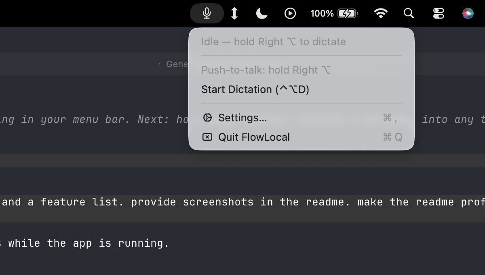
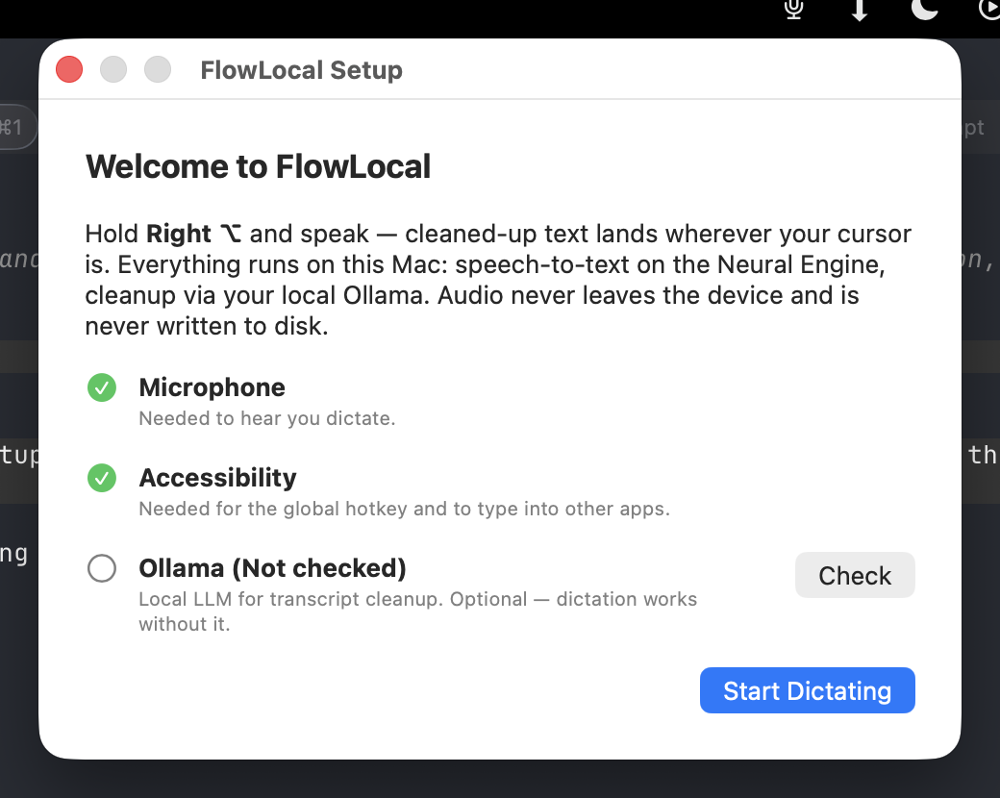
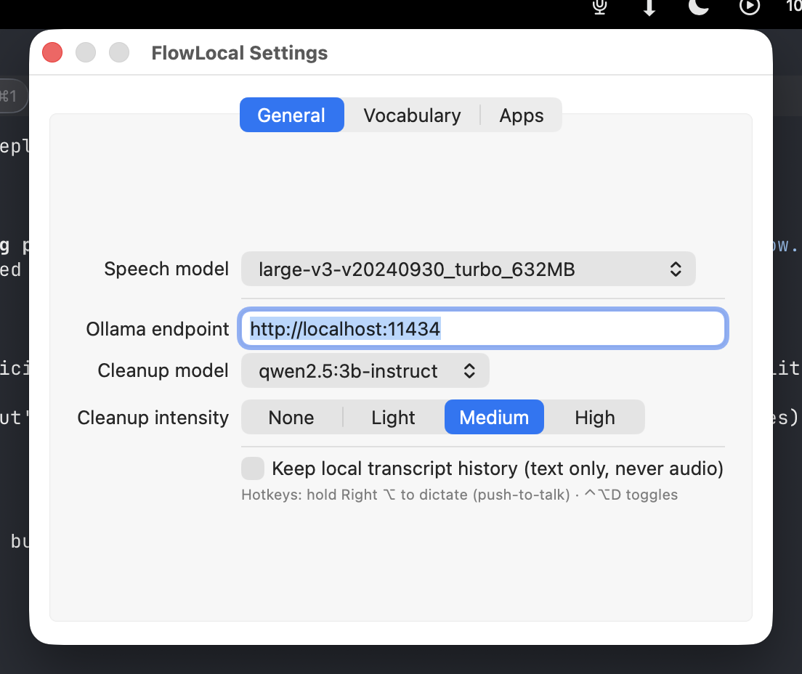
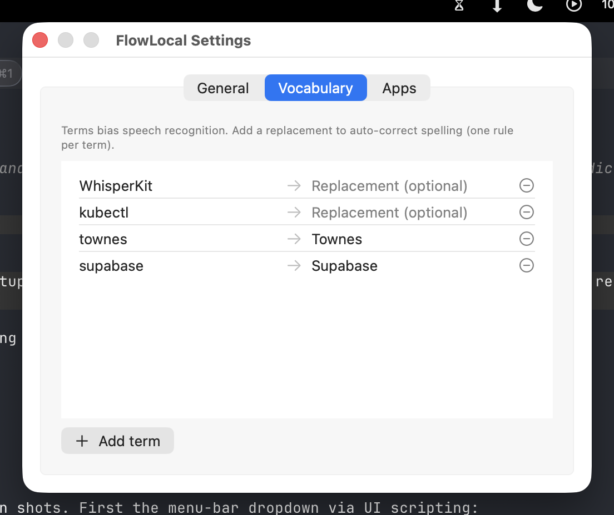

<div align="center">

# FlowLocal

**A fully local, privacy-first voice dictation app for macOS.**
Hold a key, speak, and cleaned-up text appears wherever your cursor is — in any app.

A [Wispr Flow](https://wisprflow.ai) clone that runs entirely on your Mac. No cloud, no account, no data leaving your device.




</div>

---

## What it is

Wispr Flow is a superb dictation tool, but its transcription and AI cleanup run in the cloud — your voice leaves your machine. **FlowLocal reproduces the same experience with everything running on-device:**

- **Speech-to-text** via [WhisperKit](https://github.com/argmaxinc/WhisperKit), accelerated on the Apple Neural Engine / GPU
- **AI cleanup** (filler removal, grammar, punctuation, tone) via a local [Ollama](https://ollama.com) model
- **System-wide insertion** — the cleaned text is typed into whatever app is focused

The only network traffic is to `localhost` (Ollama). Audio is processed in memory and **never written to disk**.

## How it works

```
        ┌── hold Right ⌥ ──┐
        ▼                  │
   🎙  AVAudioEngine        │  live partial transcript shown in a floating HUD
        │                  │
        ▼                  │
   🧠  WhisperKit  ─────────┘  on-device STT (Neural Engine), streaming
        │
        ▼  (on release)
   ✨  Ollama LLM              filler removal · grammar · punctuation · tone
        │                     (4 intensity levels, runs on localhost)
        ▼
   🔧  Post-processing        voice commands · custom vocabulary · per-app formatting
        │
        ▼
   ⌨️  Text insertion         Accessibility API → clipboard-paste fallback
        │
        ▼
   📝  …text appears at your cursor, in any app
```

## Features

- 🎙 **Push-to-talk dictation** — hold **Right ⌥** and speak; release to insert. Or **⌃⌥D** to toggle hands-free.
- ⚡ **Live streaming transcript** — a floating HUD shows partial results as you talk, so you know it's listening.
- ✨ **AI cleanup with 4 intensity levels** — from raw passthrough to full grammar-and-tone polish, powered by a local LLM.
- 📖 **Custom vocabulary** — teach it names, jargon, and acronyms; bias recognition and auto-correct spelling.
- 🗣 **Voice commands** — say *"scratch that"* to undo, *"new line"* / *"new paragraph"* for breaks.
- 🪟 **App-awareness** — drops the trailing period in messaging apps (Messages, Slack, WhatsApp, Discord) for a casual feel; keeps it formal elsewhere.
- 🔒 **100% local & private** — no cloud, no telemetry, no account. Audio never touches the disk.
- 🍎 **Native & lightweight** — a Swift menu-bar app with no dock icon, using Metal/ANE acceleration.

<div align="center">

<br><em>First-run setup walks you through the two required permissions and verifies Ollama.</em>
</div>

## Requirements

- **macOS 14 (Sonoma) or later** on **Apple Silicon** (M-series)
- **Xcode 15+** command-line tools (`swift`)
- **[Ollama](https://ollama.com)** installed and running (for the AI cleanup layer — dictation still works without it)

## Setup

```bash
# 1. Clone
git clone https://github.com/AlanRoybal/FlowLocal.git
cd FlowLocal

# 2. Pull the default cleanup model (~2 GB)
ollama pull qwen2.5:3b-instruct

# 3. Build the app bundle
./scripts/make_app.sh

# 4. Launch
open build/FlowLocal.app
```

On first launch, an onboarding window walks you through granting **Microphone** and **Accessibility** permissions (both required), and verifies Ollama is reachable. The default speech model (~632 MB) downloads automatically on first run.

> **Note on signing:** `make_app.sh` automatically signs with your Apple Development certificate if you have one (recommended — ad-hoc signatures change every rebuild, which makes macOS silently revoke the Accessibility grant). It falls back to ad-hoc signing otherwise.

## Usage

| Action | How |
| --- | --- |
| **Dictate** (push-to-talk) | Hold **Right ⌥**, speak, release |
| **Dictate** (hands-free) | **⌃⌥D** to start / stop |
| **Undo last dictation** | say *"scratch that"* or *"delete that"* |
| **Line break** | say *"new line"* / *"new paragraph"* |
| **Open settings** | menu-bar icon → **Settings…** |

The menu-bar icon reflects the current state: idle 🎙, listening, transcribing, cleaning, or error.

## Configuration

Everything is configurable from the menu-bar **Settings…** window.

<div align="center">


</div>

**General** — pick the speech model (accuracy vs. RAM), the Ollama endpoint and cleanup model, and the cleanup intensity:

| Intensity | Behavior |
| --- | --- |
| **None** | Raw transcript, LLM bypassed entirely |
| **Light** | Remove filler words, fix typos |
| **Medium** *(default)* | + grammar, punctuation, list formatting |
| **High** | + light rephrasing for clarity |

**Vocabulary** — add terms to bias recognition (fed to Whisper as a prompt) and optional replacement rules to auto-correct spelling.

**Apps** — edit the list of "casual" apps where the trailing period is dropped.

### Models

**Speech (WhisperKit):** `large-v3-v20240930_turbo_632MB` (default) · `distil-whisper` · `small` · `base` · `tiny` — smaller is faster and lighter, larger is more accurate.

**Cleanup (Ollama):** `qwen2.5:3b-instruct` (default) · `llama3.1:8b` (best quality) · `gemma2:2b` (fastest) · `phi3`. Pull any with `ollama pull <model>`.

## Privacy

- **Audio** is processed in memory, never written to disk, and never leaves your Mac.
- **Transcripts** are inserted at your cursor. An optional local text history is **off by default**.
- **Network:** the app talks only to your local Ollama server. The single exception is a one-time model download from Hugging Face when you first select a speech model.

The app runs **unsandboxed** (App Sandbox off), because the Accessibility API (typing into other apps) and CGEvent taps (the global hotkey) don't function inside the sandbox. It is signed with the hardened runtime and declares only the microphone entitlement (see `Resources/FlowLocal.entitlements`).

## Text insertion

FlowLocal inserts text with a two-tier strategy:

1. **Accessibility API** — sets the focused element's text directly. Precise, but silently unsupported in some apps (Google Docs, VS Code, Electron apps).
2. **Clipboard fallback** — saves your clipboard, pastes via a synthesized ⌘V, then restores your clipboard. Works nearly everywhere.

## Development

```bash
swift build                                  # debug build
.build/debug/FlowLocal                        # run the menu-bar app from a terminal
.build/debug/FlowLocal --selftest             # verify model load + transcription (headless)
.build/debug/FlowLocal --process-test         # verify commands / vocab / app-rules logic
.build/debug/FlowLocal --clean-test "um so"    # verify the Ollama cleanup pass
.build/debug/FlowLocal --insert-test "hi"      # insert text into the focused field after 3s
.build/debug/FlowLocal --model tiny            # temporary speech-model override
```

**Module layout** (`Sources/FlowLocal/`):

| Module | Responsibility |
| --- | --- |
| `Transcriber` | WhisperKit streaming STT — ~1×/sec partials + a final pass; silence/hallucination filtering |
| `Cleaner` | Ollama cleanup with intensity levels, health checks, and an answer-vs-cleanup guard |
| `TranscriptProcessor` | Voice commands, vocabulary rules, per-app formatting |
| `TextInserter` | Accessibility insertion + clipboard-paste fallback (clipboard preserved) |
| `HotkeyManager` | CGEvent tap — Right ⌥ push-to-talk, ⌃⌥D toggle |
| `TranscriptHUD` | Floating live-transcript panel |
| `AppDelegate` | Menu bar, state machine, pipeline wiring |
| `SettingsWindow` / `OnboardingWindow` | SwiftUI configuration + first-run flow |

## Limitations & roadmap

- Text is inserted on hotkey **release**, not streamed word-by-word as you speak (matching most open-source alternatives; true streaming insertion is a possible future addition).
- First model load in a fresh build takes ~1–3 minutes while CoreML compiles for the Neural Engine; subsequent launches are fast.
- Custom keyboards / secure fields (e.g. password fields) can't be typed into — a macOS platform restriction.

## Acknowledgements

Built on [WhisperKit](https://github.com/argmaxinc/WhisperKit) by Argmax and [Ollama](https://ollama.com). Inspired by [Wispr Flow](https://wisprflow.ai) and the open-source dictation community ([VoiceInk](https://github.com/beingpax/VoiceInk), [Handy](https://github.com/cjpais/Handy), [OpenWhispr](https://github.com/OpenWhispr/openwhispr)).

## License

[MIT](LICENSE)
